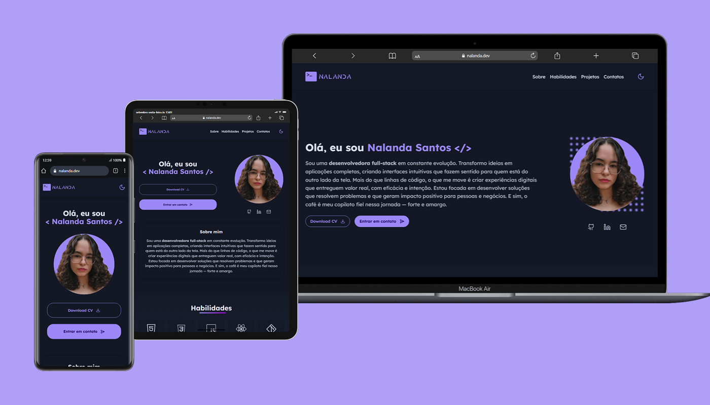

# 🌐 Portfólio Pessoal - Nalanda Santos

Este é o meu portfólio pessoal, desenvolvido com **React** e hospedado na **AWS**, para apresentar minha trajetória, habilidades e principais projetos.  
O site foi construído com foco em **performance, usabilidade e design responsivo**, servindo como minha vitrine profissional para candidaturas e oportunidades.

  

---

## ✨ Destaques  
✔️ **Tema escuro e claro** com persistência no `localStorage`  
✔️ **Animações de entrada** utilizando **ScrollReveal**  
✔️ **Efeito máquina de escrever (typewriter)** para destaque do nome  
✔️ **Design responsivo** (mobile-first, adaptado a diferentes telas)  
✔️ **SEO otimizado** com sitemap, robots.txt, Open Graph e Twitter Card  
✔️ **Código organizado** em componentes reutilizáveis  
✔️ **UI/UX profissional**: navegação intuitiva e foco em experiência do usuário

---

## 🛠️ Tecnologias Utilizadas  
- **React.js** (biblioteca principal)  
- **JavaScript (ES6+)**  
- **HTML5 & CSS3** (com uso de variáveis de tema e responsividade)  
- **ScrollReveal.js** (animações de entrada)  
- **Lucide Icons** (ícones modernos e leves)  
- **React Awesome Shapes** (elementos visuais decorativos)  
- **AWS (Amazon Web Services)** – hospedagem do build de produção, garantindo escalabilidade e confiabilidade

---

## 📂 Estrutura do Portfólio  
- **Home / Sobre mim** → apresentação e typewriter effect  
- **Habilidades** → stacks organizadas em cards interativos  
- **Projetos** → destaques de projetos autorais e freelancers  
- **Contato** → links diretos para e-mail e redes sociais  

---

## 🚀 Deploy

O projeto está hospedado na **AWS**, utilizando a infraestrutura de nuvem da Amazon para garantir alta disponibilidade e carregamento otimizado.  

Acesse em: **[https://nalanda.dev](https://nalanda.dev)**  

---

## 🔍 SEO & Acessibilidade  
- `robots.txt` e `sitemap.xml` configurados para indexação correta  
- **Meta tags sociais** (Open Graph e Twitter Card) para melhor visualização em compartilhamentos  
- Acessibilidade básica garantida: contraste, navegação clara e foco em usabilidade  

---

## 📫 Contato  
- 🌐 Site: [nalanda.dev](https://nalanda.dev)  
- 💼 LinkedIn: [linkedin.com/in/nalanda-santos-60b65a264](https://linkedin.com/in/nalanda-santos-60b65a264)  
- 💻 GitHub: [github.com/nalandasouza](https://github.com/nalandasouza)  
- 📧 E-mail: nalandasantos.dev@gmail.com  

---

🔹 **Esse portfólio é meu cartão de visitas digital e está em constante evolução.**  
Feedbacks e conexões são sempre bem-vindos! 🚀  